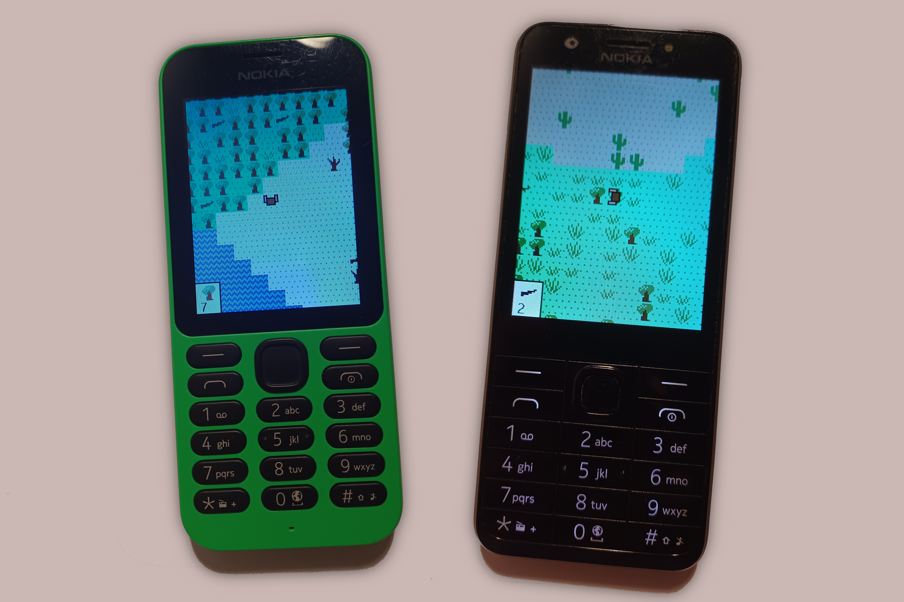

# mtmine64
Top-down 2D block building and exploration game for [MediaTek MRE](https://lpcwiki.miraheze.org/wiki/MediaTek_MRE) feature phones. Supports keypad phones with 240×320 resolution and low RAM (64 kB or above).

## Features
* Four biomes - plains, forest, desert, tundra
* Terrain decorations - rivers, trees, tall grass, cacti...
* Automatic world saving
* Inventory

## Controls
* D-pad: move player
* Number keys (1, 2, 3, 4, 6, 7, 8, 9): place or remove block in that direction
* D-pad center: open inventory

## How to build
1. Install the dependencies outlined in the [MRE Makefile](https://github.com/gtrxAC/mre-makefile#dependencies) project.
2. Run `make`.

## License
Files in the `sdk/` folder (except for `build.py`) are taken from the MRE SDK. All other files are available under the MIT License.